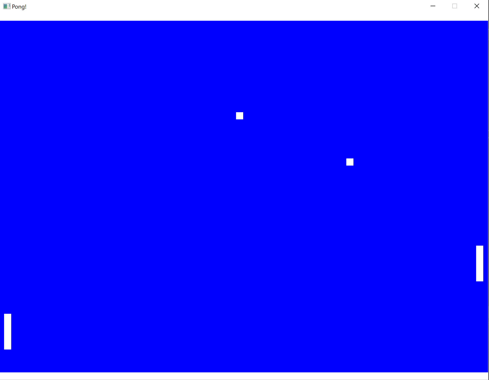

# Pong

Pong recreated in C++ using SDL2.

# Features
- Multiball! Using a Vector 
- Typical game loop with:
    - ProcessInput() - handles close events and keyboard input
    - Update() - updates player and ball based on simple collisions and inputs
    - GenerateOutput() - draws paddle, walls, and ball (all rects) to the screen
- 2 player support
    - p1: W/S 
    - p2: I/K

